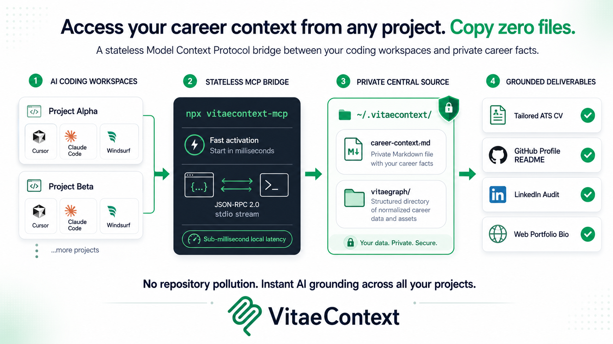

<p align="center">
  
</p>

<p align="center">
  <strong>Keep your career context. Reuse it across AI.</strong>
</p>

<p align="center">VitaeContext gives AI agents a private, reusable source of truth about a person's career, then provides focused skills and a Model Context Protocol (MCP) server for turning that context into grounded professional work.</p>

<p align="center">
  <a href="https://www.npmjs.com/package/vitaecontext"></a>
  <a href="#modules"></a>
  <a href="#mcp-server"></a>
  <a href="https://github.com/vitaecontext/vitaecontext/actions/workflows/validate.yml"></a>
  <a href="https://github.com/vitaecontext/vitaecontext/stargazers"></a>
  <a href="./LICENSE"></a>
  
</p>

<p align="center">
  <a href="#why-vitaecontext">Why</a> •
  <a href="#how-it-works">How it works</a> •
  <a href="#quick-start">Quick start</a> •
  <a href="#mcp-server">MCP Server</a> •
  <a href="#vitaegraph">VitaeGraph</a> •
  <a href="#modules">Modules</a> •
  <a href="#install">Install</a> •
  <a href="#documentation">Documentation</a> •
  <a href="https://vitaecontext.github.io/">Website</a>
</p>

---

## Why VitaeContext

> Formerly AgentKit SEO. The project grew beyond profile SEO into reusable career context for grounded AI work. The deprecated `agentkit-seo` command remains available as a compatibility alias and forwards to the VitaeContext CLI.

Every new AI chat starts with the same problem: the agent does not know which career facts are current, which claims have evidence, what role is being targeted, or how the output should change for each platform.

The usual result is repeated explanation, inconsistent profiles, generic writing, and occasionally invented claims.

VitaeContext applies the familiar `AGENTS.md` and `CLAUDE.md` pattern to professional identity. Its Context Builder skill turns a user's raw career material into a private Markdown source of truth called a **Career Context file**. Focused skills then adapt that file for LinkedIn, GitHub, CV/ATS, web portfolios, and X/Twitter.

The goal is simple:

- Explain professional context once instead of rebuilding it in every chat.
- Keep facts, goals, constraints, proof links, and claims to avoid in one reusable file.
- Adapt the same evidence to each platform without turning positioning into invention.
- Reuse the workflow across supported AI coding agents via standard Agent Skills or a stateless MCP server.

### The context layer before career automation

Many tools can draft a CV, tailor an application, write a message, or automate a career workflow. Those tools can only work from the career information they receive. When that input is scattered, stale, incomplete, or overstated, the same problems travel through the rest of the workflow.

VitaeContext sits one logical layer before those systems. It helps create and maintain the private, evidence-bounded Career Context file that an agent, CV builder, application workflow, or other career tool can use as its starting point. VitaeContext is provider- and system-agnostic: it does not require a particular AI provider or downstream automation product. The file stays portable so it can be supplied wherever precise career context is needed.

## How it works

<p align="center">
  
</p>

1. **Gather the raw material.** Start with CVs, profile sections, GitHub and portfolio links, exports, screenshots, and project notes.
2. **Create the Career Context file with VitaeContext.** Give the raw material to an AI agent and invoke `vitaecontext-build`. The skill guides the agent in organizing the material into one private Markdown file containing verified facts, stated goals, constraints, proof links, and evidence boundaries.
3. **Load one focused skill or query via MCP.** Use the LinkedIn, GitHub, CV/ATS, web portfolio, or X/Twitter module for the surface being improved.
4. **Produce grounded work.** Get an audit, rewrite, patch proposal, or action plan based on the supplied context and platform guidance.

The Career Context file supplies facts and direction. Platform skills supply formatting, discoverability guidance, and channel-specific constraints. They do not become a second source of truth.

---

## Quick start

### Set up with an agent

Copy this prompt into your agent. GitHub adds a copy control to the prompt block.

```text
Set up VitaeContext for this agent environment.

- Read https://vitaecontext.github.io/docs/installation/ and https://vitaecontext.github.io/providers/ first. Identify the matching provider and its invocation format.
- Run `npx vitaecontext install --provider <matching-provider>`. Do not use `--force` or change install locations unless I approve it.
- Verify the installation with `npx vitaecontext doctor`, then tell me which skills are available and how to invoke them here.
- Ask me for a private file path, initialize it with `npx vitaecontext context init --output <private-path>`, and explain that validation will fail until its placeholders are replaced.
- Read https://vitaecontext.github.io/docs/usage/ and propose three practical next steps. Start with building the context from career material I choose to share, then suggest one focused skill for my immediate goal. Do not upload or share my files without asking.
```

Install the skills for an agent provider:

```bash
npx vitaecontext install --provider codex
```

Initialize a minimal Career Context file in a private location:

```bash
npx vitaecontext context init --output ~/.vitaecontext/name-surname-career-context.md
```

Ask an agent to build the context from trusted material:

```text
Use vitaecontext-build to create my Career Context file.
I can provide my CV, LinkedIn sections, GitHub URL, portfolio URL, project notes,
screenshots, or other career material.
```

Then use one platform skill:

```text
Use vitaecontext-github to audit my GitHub profile for hiring visibility.
Use my Career Context file at ~/.vitaecontext/name-surname-career-context.md.
```

Keep the Career Context file private. A portable default location is:

```text
~/.vitaecontext/<name-surname>-career-context.md
```

After filling it, validate the structure and create a bounded task packet:

```bash
npx vitaecontext context validate ~/.vitaecontext/name-surname-career-context.md
npx vitaecontext context summary ~/.vitaecontext/name-surname-career-context.md --for github --output /tmp/github-context.md
```

---

## MCP Server

[VitaeContext MCP](./mcp/README.md) provides a stateless Model Context Protocol interface adhering to version `2024-11-05`.

<p align="center">
  
</p>

By registering `vitaecontext-mcp` with your AI coding tool, agents across all repositories can read your private Career Context and VitaeGraph without copying career files into your codebase.

```bash
# Direct MCP stdio execution
npx -y vitaecontext-mcp
```

### Client configuration

Add to your tool's MCP configuration (e.g. `claude_desktop_config.json`, Cursor Settings, or Windsurf config):

```json
{
  "mcpServers": {
    "vitaecontext": {
      "command": "npx",
      "args": ["-y", "vitaecontext-mcp"]
    }
  }
}
```

See [mcp/README.md](./mcp/README.md) and [mcp/config-examples/](./mcp/config-examples/) for complete setup instructions across Claude Desktop, Claude Code, Cursor, Windsurf, Roo Code, Antigravity, IBM Bob, and Grok.

---

## VitaeGraph

[VitaeGraph](./vitaegraph/README.md) is VitaeContext's deeper structured-memory layer, not a separate product. Use the Career Context file for compact, repeated facts and quick grounded drafts. Use VitaeGraph when an agent needs detailed records for projects, roles, degrees, courses, thesis work, certifications, awards, publications, and the relationships between them.

<p align="center">
  
</p>

Its root directory is an independently readable product entrypoint containing the format specification, schema, graph model, and canonical templates. Markdown remains canonical; generated JSON files are rebuildable local indexes.

```text
~/.vitaecontext/
├── <name-surname>-career-context.md
└── vitaegraph/
```

Create and check the default private graph:

```bash
npx vitaecontext graph init
npx vitaecontext graph validate
npx vitaecontext graph index
```

---

## Modules

VitaeContext ships one compact-context module, VitaeGraph, and five platform modules, coordinated by the root routing skill.

| Goal | Module | Public playbook |
| --- | --- | --- |
| Build the reusable Career Context layer | [`vitaecontext-build`](./hub/context-builder/README.md) | [Context Builder](https://vitaecontext.github.io/playbooks/context-builder/) |
| Build a detailed local career knowledge graph | [`vitaecontext-vitaegraph`](./skills/vitaecontext-vitaegraph/SKILL.md) | [VitaeGraph specification and templates](./vitaegraph/README.md) |
| Improve GitHub profile and repository discoverability | [`vitaecontext-github`](./hub/github/README.md) | [GitHub optimization](https://vitaecontext.github.io/playbooks/github/) |
| Improve LinkedIn structure, search visibility, and proof | [`vitaecontext-linkedin`](./hub/linkedin/README.md) | [LinkedIn optimization](https://vitaecontext.github.io/playbooks/linkedin/) |
| Tailor a CV or resume for ATS parsing and recruiter readability | [`vitaecontext-cv`](./hub/cv-ats/README.md) | [CV and ATS optimization](https://vitaecontext.github.io/playbooks/cv-ats/) |
| Improve portfolio crawlability, SEO, and AI readability | [`vitaecontext-portfolio`](./hub/web-portfolio/README.md) | [Web portfolio optimization](https://vitaecontext.github.io/playbooks/web-portfolio/) |
| Improve X/Twitter positioning and posting strategy | [`vitaecontext-x`](./hub/x-twitter/README.md) | [X/Twitter optimization](https://vitaecontext.github.io/playbooks/x-twitter/) |

---

## Install

Install one provider at a time:

```bash
npx vitaecontext install --provider codex
```

Supported providers:

| Provider | Default destination | Activation model |
| --- | --- | --- |
| `shared` | Portable `SKILL.md` folders | Manual reuse or packaging |
| `claude-code` | `~/.claude/skills/` | Ask for the installed skill by name |
| `codex` | `~/.agents/skills/` plus `CODEX_HOME/skills` or `~/.codex/skills/` | Use installed skills by name when available |
| `gemini-cli` | `~/.gemini/extensions/vitaecontext/` | Namespaced commands such as `/vitaecontext:linkedin` |
| `antigravity` | `~/.gemini/antigravity-cli/plugins/vitaecontext/` | Gemini-compatible plugin layout |
| `opencode` | `~/.config/opencode/skills/` plus command wrappers | Native skill loading and flat command wrappers |
| `cursor` | `.cursor/skills/` | Native Cursor Agent Skills |
| `windsurf` | `.windsurf/skills/` | Native Windsurf Cascade Skills |
| `roo-code` | `.roo/skills/` | Native Roo Code / Cline Skills |
| `ibm-bob` | `.ibm/skills/` | IBM Bob / watsonx Code Assistant Skills |
| `grok` | `.grok/skills/` | xAI Grok Agent Skills |

For Claude Code, the skills are also available through the plugin marketplace:

```text
/plugin marketplace add vitaecontext/vitaecontext
/plugin install vitaecontext@vitaecontext
```

Useful package commands:

```bash
npx vitaecontext version
npx vitaecontext mcp
npx vitaecontext update
npx vitaecontext doctor
npx vitaecontext list providers
npx vitaecontext list skills
npx vitaecontext context init
npx vitaecontext context validate ~/.vitaecontext/career-context.md
npx vitaecontext context summary ~/.vitaecontext/career-context.md --for cv
npx vitaecontext graph init
npx vitaecontext graph validate
npx vitaecontext graph index
```

---

## What is inside

This repository keeps human guidance, runtime skills, provider adapters, MCP, and packaging separate:

- [`hub/`](./hub/) contains public playbooks, templates, examples, and source notes.
- [`vitaegraph/`](./vitaegraph/) contains the public VitaeGraph specification, schemas, and canonical artifact templates.
- [`skills/`](./skills/) contains the canonical portable standard Agent Skills.
- [`src/`](./src/) and [`bin/`](./bin/) contain the core engine, CLI, and stateless MCP server.
- [`providers/`](./providers/) contains thin provider-specific adapters.
- [`mcp/`](./mcp/) contains Model Context Protocol documentation, client configs, and protocol contracts.
- [`llms.txt`](./llms.txt) and [`llms-full.txt`](./llms-full.txt) expose the project map and wiki bundle to LLM tools.

Read [DESIGN.md](./DESIGN.md) for the system design and [the architecture map](./.assets/docs/architecture-map.md) for repository ownership and edit boundaries.

## Documentation

- [Getting started](./.assets/docs/getting-started.md) explains installation, first use, and graph navigation.
- [Fictional five-minute demo](./.assets/docs/fictional-end-to-end-demo.md) shows raw material, validated context, a bounded packet, and a grounded task brief without publishing real career data.
- [End-to-end demos](./.assets/docs/end-to-end-workflows.md) provides sample inputs, prompts, and expected deliverables.
- [Public playbooks](./hub/) document the human-readable methodology for each module.
- [Model Context Protocol](./mcp/README.md) details cross-project MCP integration.
- [Maintaining](./MAINTAINING.md) covers source refresh, wiki maintenance, validation, and releases.
- [Contributing](./CONTRIBUTING.md) explains how to propose ideas, report issues, and open pull requests.
- [Contributing instructions](./AGENTS.md) define repository rules for coding agents.
- [Changelog](./CHANGELOG.md) records public release history.
- [Privacy](./PRIVACY.md) and [security](./SECURITY.md) describe project policies.

## Authors

Maintained by **Renato Mignone** and **Elia Innocenti**.

| Author | GitHub | LinkedIn | Portfolio |
| --- | --- | --- | --- |
| **Renato Mignone** | [GitHub](https://github.com/RenatoMignone) | [LinkedIn](https://www.linkedin.com/in/renato-mignone/) | [Portfolio](https://renatomignone.github.io/) |
| **Elia Innocenti** | [GitHub](https://github.com/eliainnocenti) | [LinkedIn](https://www.linkedin.com/in/eliainnocenti/) | [Portfolio](https://eliainnocenti.github.io/) |

If VitaeContext is useful, [star the repository](https://github.com/vitaecontext/vitaecontext) to help more people find it.
