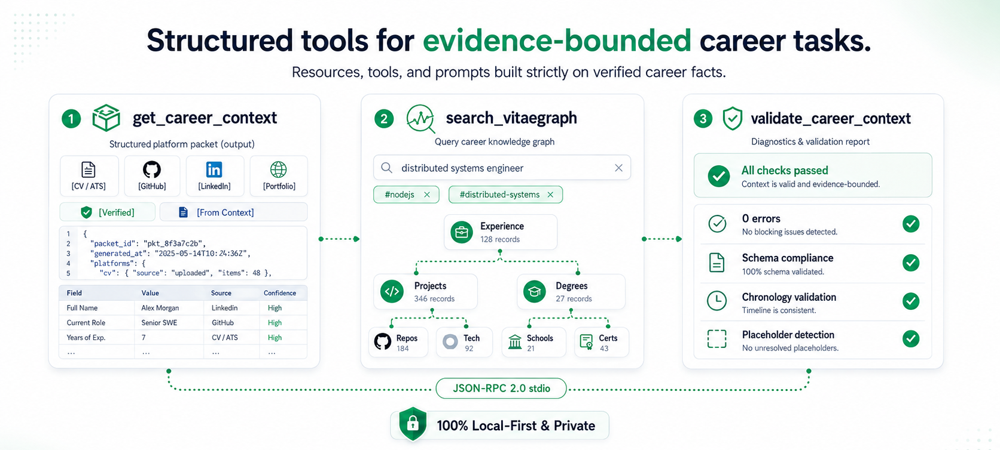

<p align="center">
  <strong>Stateless Model Context Protocol server for cross-repository career context.</strong>
</p>

<p align="center">Connect your private Career Context and VitaeGraph to AI coding assistants across any project workspace without copying career files or pasting private notes into chats.</p>

<p align="center">
  <a href="#protocol-conformance"></a>
  <a href="#quick-start"></a>
  <a href="#privacy-and-workspace-isolation"></a>
  <a href="#protocol-conformance"></a>
  <a href="../LICENSE"></a>
</p>

<p align="center">
  <a href="#why-mcp-for-career-context">Why</a> •
  <a href="#how-it-works">How it works</a> •
  <a href="#quick-start">Quick start</a> •
  <a href="#client-configurations">Client setup</a> •
  <a href="#capabilities">Capabilities</a> •
  <a href="#how-to-test-the-mcp-server">Testing guide</a> •
  <a href="#privacy-and-workspace-isolation">Privacy</a>
</p>

---

# VitaeContext MCP Server

The VitaeContext Model Context Protocol (MCP) server provides a stateless bridge between AI coding assistants and a user's private career source of truth.

By registering the VitaeContext MCP server in your AI coding tool, agents in **any** project workspace can immediately query your private Career Context and VitaeGraph without needing to copy files into the repository or paste career notes into the chat.

---

## Why MCP for Career Context

When working across multiple repositories, developer agents frequently need career facts—such as writing repository profile READMEs, drafting portfolio entries, preparing release bios, or updating professional docs.

<p align="center">
  
</p>

### Key Advantages

1. **Zero Workspace Pollution**: No career files or personal context documents need to be copied into individual git repositories.
2. **Instant Cross-Project Grounding**: Any tool supporting MCP can query your career records on demand.
3. **Always Current**: Edits made to `~/.vitaecontext/career-context.md` or `~/.vitaecontext/vitaegraph/` are immediately reflected across all agent chats.
4. **Evidence-Bounded**: Exposes structured tools that preserve supplied facts and evidence limits for the requested platform without claiming independent verification.
5. **Zero Runtime Dependencies**: Built with native Node.js ESM and available through the published `vitaecontext` package via `npx -y vitaecontext mcp`.

---

## Quick Start

### Direct Execution

Run the server over standard input/output (stdio JSON-RPC 2.0):

```bash
# Using npx (downloads the published package when needed)
npx -y vitaecontext mcp

# Or after installing the vitaecontext package
vitaecontext mcp
```

### Protocol Conformance

| Parameter | Specification |
| --- | --- |
| **Protocol Version** | `2024-11-05` |
| **Transport** | `stdio` (JSON-RPC 2.0 with newline-delimited framing) |
| **Runtime Requirements** | Node.js `>= 18.0.0` |
| **Dependencies** | `0` external runtime dependencies (pure native ESM) |
| **Discovery Paths** | `~/.vitaecontext/career-context.md`, one unambiguous matching context file, and `~/.vitaecontext/vitaegraph/` |

---

## Client Configurations

### Claude Desktop

Add to your `claude_desktop_config.json`:
* **macOS**: `~/Library/Application Support/Claude/claude_desktop_config.json`
* **Windows**: `%APPDATA%\Claude\claude_desktop_config.json`
* **Linux**: `~/.config/Claude/claude_desktop_config.json`

```json
{
  "mcpServers": {
    "vitaecontext": {
      "command": "npx",
      "args": ["-y", "vitaecontext", "mcp"]
    }
  }
}
```

### Claude Code

Add the server using the native Claude Code MCP command:

```bash
claude mcp add vitaecontext -- npx -y vitaecontext mcp
```

### Cursor IDE

1. Open Cursor **Settings** (`Cmd+,` or `Ctrl+,`).
2. Navigate to **Features** -> **MCP Servers**.
3. Click **+ Add new MCP server**.
4. Configure:
   * **Name**: `vitaecontext`
   * **Type**: `command`
   * **Command**: `npx -y vitaecontext mcp`

### Windsurf (Cascade)

Add to your `~/.codeium/windsurf/mcp_config.json`:

```json
{
  "mcpServers": {
    "vitaecontext": {
      "command": "npx",
      "args": ["-y", "vitaecontext", "mcp"]
    }
  }
}
```

### Roo Code / Cline

Add to your `cline_mcp_settings.json` or `roo_code_mcp_settings.json`:

```json
{
  "mcpServers": {
    "vitaecontext": {
      "command": "npx",
      "args": ["-y", "vitaecontext", "mcp"]
    }
  }
}
```

### Antigravity CLI

Add to your `~/.gemini/antigravity-cli/mcp_config.json`:

```json
{
  "mcpServers": {
    "vitaecontext": {
      "command": "npx",
      "args": ["-y", "vitaecontext", "mcp"]
    }
  }
}
```

### IBM Bob / watsonx Code Assistant

Add to your `.ibm/mcp_config.json`:

```json
{
  "mcpServers": {
    "vitaecontext": {
      "command": "npx",
      "args": ["-y", "vitaecontext", "mcp"]
    }
  }
}
```

### xAI Grok

Add to your `.grok/mcp_config.json`:

```json
{
  "mcpServers": {
    "vitaecontext": {
      "command": "npx",
      "args": ["-y", "vitaecontext", "mcp"]
    }
  }
}
```

### Select private data explicitly

The server prefers `~/.vitaecontext/career-context.md`. If that file is absent and exactly one `*-career-context.md` or `*.context.md` file exists, it uses that file. If multiple candidates exist, the server returns a selection message instead of choosing one arbitrarily.

Select paths in the server command when a client needs a non-default location:

```bash
npx -y vitaecontext mcp --context /private/path/career-context.md --root /private/path/vitaegraph
```

The environment variables `VITAECONTEXT_CAREER_CONTEXT` and `VITAEGRAPH_ROOT` provide the same configuration. MCP tool arguments cannot change filesystem roots; the user controls file access when starting the server.

---

## Capabilities

<p align="center">
  
</p>

### Resources

| URI | Description | MIME Type |
| --- | --- | --- |
| `career-context://current` | Returns the user's private Career Context markdown from `~/.vitaecontext/`. | `text/markdown` |
| `vitaegraph://index` | Returns the indexed graph nodes JSON from `~/.vitaecontext/vitaegraph/.generated/graph.json`. | `application/json` |
| `vitaegraph://record/{id}` | Reads a specific record markdown by stable ID (e.g. `project:local-search-engine`). | `text/markdown` |
| `vitaecontext://wiki/{module}` | Reads the platform rules and constraint wiki for a module (e.g. `github`, `linkedin`, `cv`, `portfolio`, `x`). | `text/markdown` |

### Tools

#### 1. `get_career_context`
Retrieve a user-maintained, evidence-bounded Career Context packet for a specific professional surface.

```json
{
  "for": "github"
}
```
* **Parameters**:
  * `for` (*string*, optional): `cv`, `github`, `linkedin`, `portfolio`, `x`, `general` (default: `general`).

#### 2. `search_vitaegraph`
Query and filter structured career records in the user's private VitaeGraph.

```json
{
  "query": "distributed systems",
  "type": "project",
  "tag": "nodejs"
}
```
* **Parameters**:
  * `query` (*string*, optional): Case-insensitive text search across record ID, title, tags, and indexed record text.
  * `type` (*string*, optional): Filter by record type (`experience`, `project`, `education`, `course`, `thesis`, `certification`, `award`, `publication`).
  * `tag` (*string*, optional): Filter by exact skill/topic tag.

#### 3. `validate_career_context`
Validate a Career Context file for structural integrity, frontmatter, and unfinished placeholders.

```json
{}
```

### Prompts

| Prompt | Arguments | Description |
| --- | --- | --- |
| `cv_tailoring` | `targetRole` (required), `jobDescription` (optional) | Tailors a CV to a target role while preserving the evidence limits in Career Context. |
| `linkedin_audit` | `profileSnapshot` (optional) | Audits a LinkedIn profile against discoverability rules and internal scorecards. |
| `github_showcase` | `focus` (optional) | Audits profile README and repository showcase strategy. |
| `career_context_intake` | `rawNotes` (optional) | Guides synthesizing raw career notes into a structured, user-maintained Career Context file. |

---

## How to Test the MCP Server

### Method 1: Using the Official MCP Inspector (Interactive UI)

The official `@modelcontextprotocol/inspector` runs a visual web dashboard to interactively test tools, resources, and prompts:

```bash
# Launch the MCP inspector
npx @modelcontextprotocol/inspector npx -y vitaecontext mcp
```

1. Open the URL displayed in the terminal (usually `http://localhost:5173`).
2. Click **Connect** (Transport: `STDIO`).
3. Explore and test:
   * **Tools Tab**: Execute `get_career_context` with `{ "for": "github" }`.
   * **Resources Tab**: Read `career-context://current` or `vitaecontext://wiki/github`.
   * **Prompts Tab**: Render `cv_tailoring` with `{ "targetRole": "Lead Systems Architect" }`.

### Method 2: Command-Line `stdio` Piping

You can send standard JSON-RPC 2.0 payloads directly via stdin:

```bash
# 1. Initialize Handshake
printf '{"jsonrpc":"2.0","id":1,"method":"initialize","params":{"protocolVersion":"2024-11-05","capabilities":{},"clientInfo":{"name":"tester","version":"1.0.0"}}}\n' | npx -y vitaecontext mcp

# 2. List Available Tools
printf '{"jsonrpc":"2.0","id":2,"method":"tools/list","params":{}}\n' | npx -y vitaecontext mcp

# 3. Call get_career_context Tool
printf '{"jsonrpc":"2.0","id":3,"method":"tools/call","params":{"name":"get_career_context","arguments":{"for":"cv"}}}\n' | npx -y vitaecontext mcp
```

### Method 3: Automated Test Suite

Run the built-in unit and integration test suite:

```bash
npm test
```

---

## Privacy and Workspace Isolation

The VitaeContext MCP server is designed around local-first privacy:

1. **Local Operations Only**: The running server reads only the selected local Career Context, VitaeGraph, and packaged wiki files. It makes no network or telemetry requests; `npx` may contact npm to obtain the package before launch.
2. **Zero Repository Pollution**: Private career files are never copied or written into individual project workspaces.
3. **Evidence-Bounded**: Platforms receive bounded task packets with explicit evidence labels, reducing the risk of unsupported claims.
4. **Stateless Runtime**: No background daemon, tokens, or persistent database state.

---

## Specification & Contract

For the formal JSON-RPC 2.0 schema contract, error codes, and transport details, see [schema/mcp-contract.md](./schema/mcp-contract.md).
